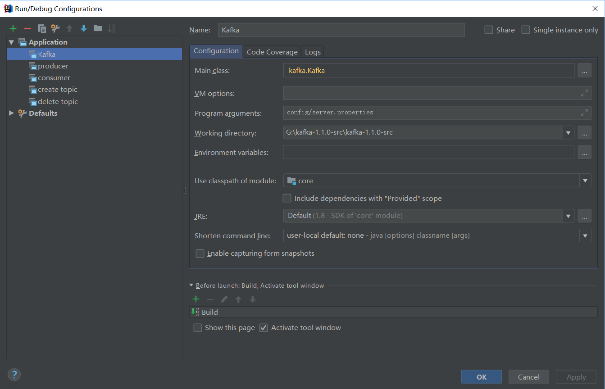
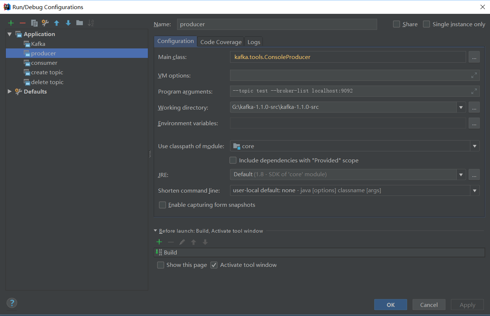
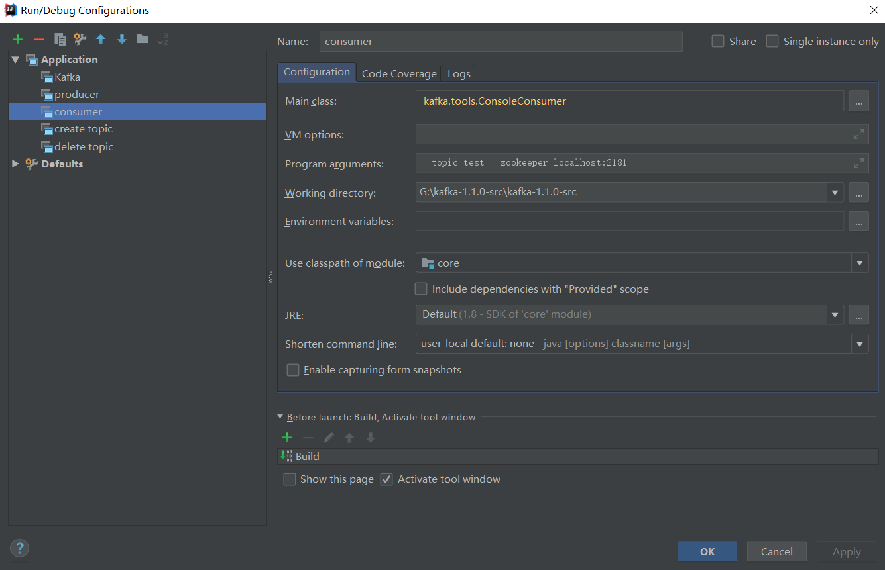
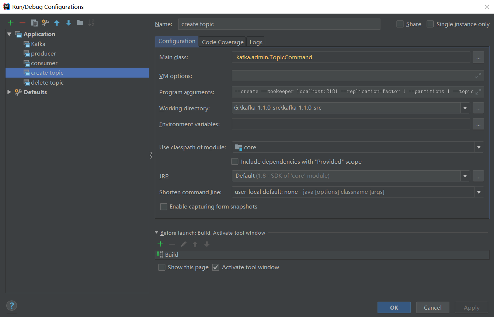
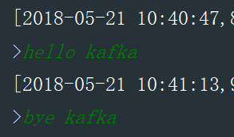
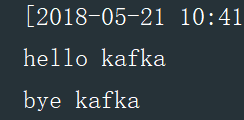

https://github.com/apache/kafka

kafka源码解析 

# Dev

* Unix / Linux or Win10 platform 

* Github, Markdown, IntelliJ IDEA

* Gradle 3.0 or higher.

* JDK 1.8+, ZooKeeper, Kafka (such as zookeeper-3.4.12 & kafka_2.11-1.1.0)

* Scala 2.12.x 

# How to build Kafka source environment

1.  Install JDK 1.8+ and set the environment variable, [link](http://www.oracle.com/technetwork/java/javase/downloads/jdk8-downloads-2133151.html).

2.  Download Scala-2.12.x and set the ```SCALA_HOME```, ```Path```, [link](https://www.scala-lang.org/download/).

3.  Install Gradle 4.0+ and set the ```GRADLE_HOME```, ```Path```, [link](https://gradle.org/install/).

4.  Download ZooKeeper, [link](https://www.apache.org/dyn/closer.cgi/zookeeper/)

5.  Build ZooKeeper environment: Copy ```%ZOOKEEPER%/conf/zoo_sample.cfg``` and rename as ```zoo.cfg```, open ```zoo.cfg``` and change ```dataDir``` to another location such as ```dataDir=E:\\zookeeper-3.4.12\\data``` in Windows.

6.  Start up ZooKeeper: Use command ```zkServer.bat``` in Windows or ```./zkServer.sh``` in Linux.

7.  Download Kafka source code and unzip it, [link](http://kafka.apache.org/downloads).

8.  Add some gradle dependence in ```build.gradle```: 

```gradle
...

compile libs.slf4jlog4j

...

compile(libs.zookeeper) {

      ...

      exclude module: 'slf4j-simple'
    }

...

// https://mvnrepository.com/artifact/org.slf4j/slf4j-simple
testCompile group: 'org.slf4j', name: 'slf4j-simple', version: '1.7.21'

...
```
8.  Build Kafka using gradle: In Kafka's root directory, Use command ```gradle idea```, wait for a few minutes util you see ```BUILD SUCCESSFUL```.

9.  Install IntelliJ IDEA Scala plugins: File -> Settings -> Plugins -> search for scala and install it.

10. Modify the Kafka configuration file: Copy ```config/log4j.properties``` to ```core/src/main/scala/log4j.properties```, the ```server.properties``` can be rewritten as needed.

11. Set Kafka startup parameters: IDEA -> Edit Configurations -> add Applications as follows:

* **Kafka startup class**  



* **Kafka producer startup class**  



* **Kafka comsumer startup class**  



* **Kafka create topic class**  



Note: You can change the ```ip```, ```replication-factor```, ```partitions``` and ```topic``` as you like.

12. Start up Kafka: Run ZooKeeper -> Run Kafka -> Run Topic_Creat -> Run Producer -> Run Consumer. 

13. You can write something in your *Producer Console* and you will see it appear in the *Consumer Console*. 

* **Producer**  

 

* **Consumer**  



# How to build simiki environment

* [Simiki Introduce](https://kafka-learn.github.io/kafka-code/intro/gettingstarted.html)

* Deployment Wiki: 

```cmd
pip install ghp-import

ghp-import -p -m "Update output documentation" -r origin -b gh-pages output
```


# Wiki

https://github.com/kafka-learn/kafka-code/wiki

# Todo

https://github.com/kafka-learn/kafka-code/projects

# Contact

If you have any questions or objections, please post an issue, if you want to join us, please contact: QQ Group：698794283